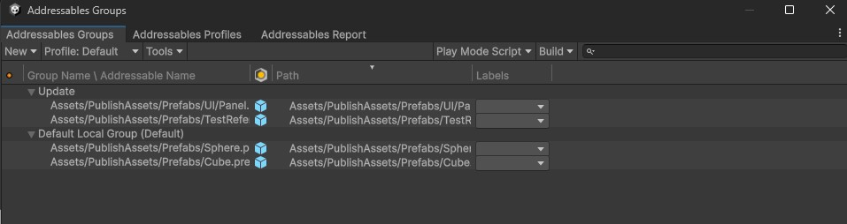

# Addressables 热更样例

## 配置

打开 `Profiles` 窗口, 菜单 `Windows/Asset Management/Addressables/Profiles`

- `Remote` 选择 `Custom`

- `Remote.BuildPath` 为 `ServerData/[BuildTarget]`

- `Remote.LoadPath` 为 `ServerUrl`

  如 `http://<ServerIP>/AssetBundles/Android` 为资源服务器

打开 `Settings` 窗口, 菜单 `Windows/Asset Management/Addressables/Settings` 

- `Build & Load Paths` 选择 `Remote`

  `Build Path` 为 `ServerData/Android`

  `Load Path` 为 `http://<ServerIP>/AssetBundles/Android`

- 勾选 `Only update catalogs manually`, 通过代码来更新

## 构建基础包

1. 打开 `Groups` 窗口, 菜单 `Windows/Asset Management/Addressables/Groups` 

   

2. 选择 `Default Local Group` 和 `Update` 组

   

3. `Build & Load Paths` 选择 `Local`

   资源输出位置 `Library\com.unity.addressables\aa`

   构建安装包时选择 `Local`, 会生成资源到 `SteamingAssets` 目录, `Remote` 不会生成到 `SteamingAssets` 目录

4. 资源复制到到安装包里 `SteamingAssets` 目录

   - 自动复制(默认)

     `Settings/Build Addressables on Play Build` 选择 `Use global Settings` 或 `Build Addressables content on Player Build` 

   - 手动复制

     `Groups` 窗口 `Build` 菜单选择 `New Build/Default Build Script` 生成资源, 复制 `Library\com.unity.addressables\aa` 到 `Assets/SteamingAssets/aa`

5. `File/Build Settings` 点击 Build 按钮构建安装包

   

6. 运行游戏

## 测试热更资源

1. 修改 `Assets/PublishAssets/Prefabs/TestReference.prefab` `TestText/text` 字段递增版本号, 用于测试更新变化

   

2. 打开 `Groups` 窗口, 菜单 `Windows/Asset Management/Addressables/Groups` 

3. 选择 `Default Local Group` 和 `Update` 组

4. `Build & Load Paths` 切换为 `Remote`

   

5. `Build/New Build/Default Build Script` 生成资源, 资源输出位置 `ServerData\Android`

   

6. 复制 `ServerData\Android` 到资源服务器 `http://<ServerIP>/AssetBundles/Android`

7. 退出游戏, 重新运行游戏

8. 版本数字变化则更新成功

